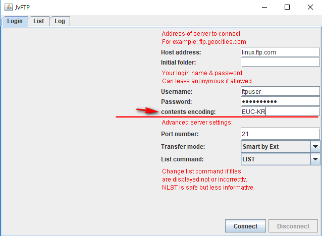

jvftp

The source code is originally from the sourceforge site. 
Check the original source site for the jvftp <http://jvftp.sourceforge.net/>

I've just added a label and a text field 
So, you can change the character set easily if you've got an unexpected characters displaying on a ftp window.

I have tested only one case that is an euc-kr.  

I haven't needed any of dependent libraries for the compilation and building the jvftp.

I always appreciate to the developers of this project.

